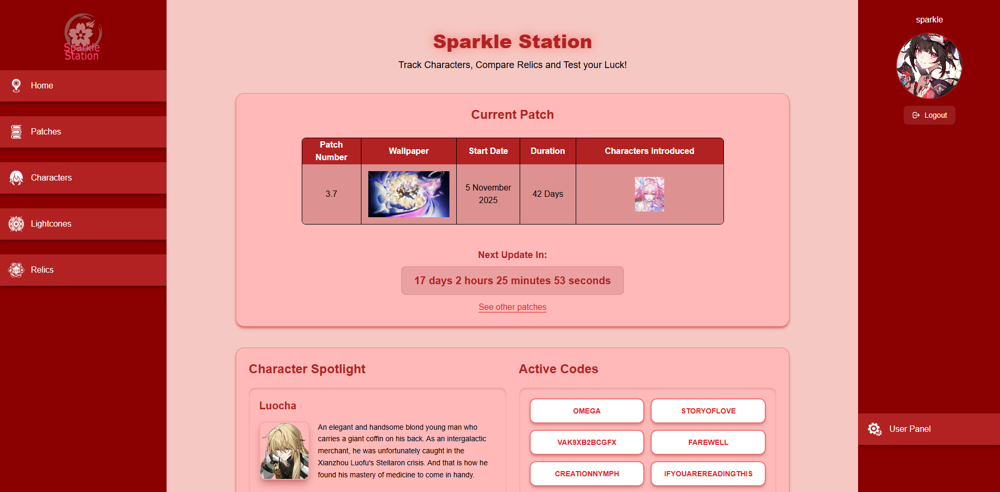

# SparkleStation  
### Personal Honkai: Star Rail Data Hub

SparkleStation is a **Laravel-based web project** built as a personal hub for **Honkai: Star Rail** data with a focus on data presentation, UI experimentation and small interactive systems.

This project was created as a **learning and portfolio project**.

---

## Overview

This application provides:
- Structured access to **characters, lightcones, patches, relics, and game metadata**
- Multiple **view modes** with sorting and filtering options
- A mix of **MPA and SPA approaches**, depending on feature requirements
- A relic rolling simulator to mimic the endless pursuit of a perfect piece.
  (character rolling planned)

The project serves both as a **personal exploration space** and a **technical showcase**.

To keep the repository size manageable, the full library of game assets (~550MB of images) and the production database are not included in this repo.

---

## Tech Stack

- **Backend:** Laravel
- **Database:** MySQL using Eloquent ORM for structured data relationships
- **Frontend:** Blade, Vanilla JavaScript, Vue.js (selectively)  
- **Architecture:** Server-rendered pages with targeted SPA components  
- **Data Handling:** AJAX-driven modals, dynamic filtering, client-side state  
- **Styling:** Tailwind CSS with project-specific custom styles

I intentionally limited Vue to the User Panel to see how far I could push Vanilla JS in the Relics section before the complexity became unmanageable.

---

## Homepage

The homepage acts as a live dashboard:
- Current patch information
- Active redemption codes
- Site-wide statistics
- Random character spotlight (refreshed on each reload)

---

## Characters

https://github.com/user-attachments/assets/463decee-2381-444c-95a8-ad5014ff95e6

The character section supports two distinct presentation modes:
- **Icon grid view** for fast browsing
- **Table view** for an alternative structured layout

Features include:
- Filtering by element, path, faction, etc.
- Sorting (ascending / descending / none)
- Click-to-sort columns in table mode

All filtering and sorting logic is handled client-side for responsiveness.

---

## Patches

https://github.com/user-attachments/assets/e98a289f-2898-46ef-8e6a-978b1adff148

Patch data can be explored through:
- **Timeline view** for chronological context
- **List view** for quick navigation

In timeline mode:
- Selecting a patch triggers an AJAX request
- A loading state is displayed
- Patch details are shown in a modal  
  (characters, light cones)

---

## Relics

https://github.com/user-attachments/assets/dbd302bf-48f3-4bb0-80fa-dee0342f614c

This entire section is a **Vanilla JS SPA**. I wanted to challenge myself to build a reactive, state-driven UI without the "safety net" of a framework, focusing on DOM manipulation and clean event handling.

---

## User Panel

https://github.com/user-attachments/assets/1bb7ee16-1590-479a-a686-be47e412b73d

The user panel is the **only Vue-powered section** of the application.

Features:
- User settings
- Personal relic inventory
- Relic generation and leveling system
- Character management page (in progress)

Vue was chosen due to higher UI complexity and shared reactive state.

---

## Learning Goals

- Practice structuring a Laravel application
- Experiment with different UI approaches for the same data
- Learn when to use Vanilla JavaScript vs Vue.js
- Improve handling of client-side state and AJAX interactions
- Keep the codebase understandable and easy to extend

This is a controlled technical playground, **not a production service**.

---

## Planned Features

- Character rolling system
- Expanded user character management

---

## Local Development Note
This repository is intended as a **code showcase** rather than a plug-and-play application. 
- **Database:** The core data is private; however, the schema can be reviewed in the `/database/migrations` directory.
- **Assets:** Game assets are excluded due to copyright and size.

---

## Legal & Credits
**SparkleStation** is a fan-made project and is not affiliated with or endorsed by **HoYoverse**.

- **Assets:** All game assets, including images, icons, and character data, are the property of **© HoYoverse (Cognosphere)**.
- **Project Purpose:** This is a non-commercial, open-source project created for educational and portfolio purposes. No copyright infringement is intended.
